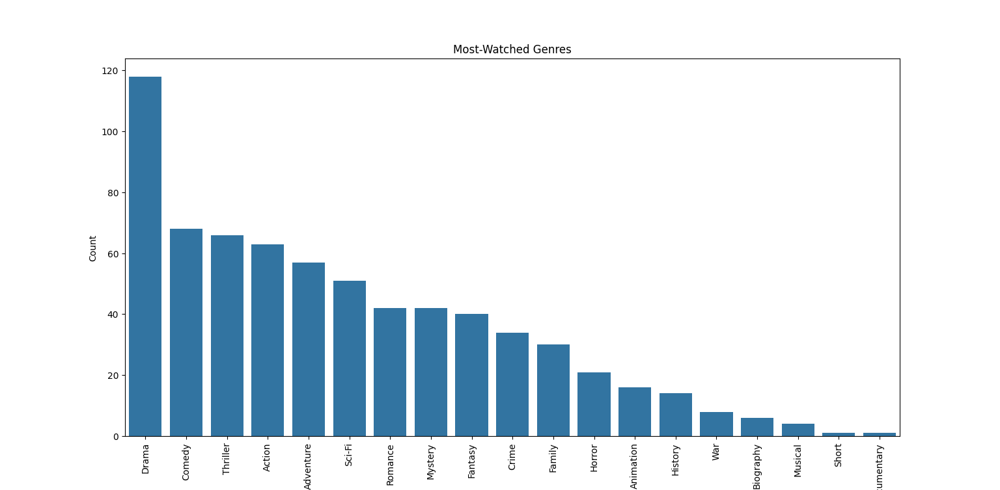

c# Data-Analysis-on-IMDb

This project is created for the course project of *Introduction to Data Science* at Sabancı University (2024-2025).  
The analysis explores my viewing habits for both movies and TV series using data from my IMDb activity and metadata retrieved from the IMDb database.  
The aim is to uncover patterns in my preferences, compare my ratings with IMDb user ratings, and gain insights into my behavior across both mediums.

---

## Table of Contents
1. [Motivation](#motivation)  
2. [Research Questions](#research-questions)  
3. [Data Source](#data-source)  
   - [Personal IMDb Data](#personal-imdb-data)  
   - [IMDb Metadata](#imdb-metadata)  
4. [Data Analysis](#data-analysis)  
5. [Findings](#findings)  
6. [Limitations](#limitations)
7. [Future Work](#future-work) 

---

## Motivation

Movies and TV series are significant parts of my leisure time, and I often wonder how my preferences compare to common trends.  
The motivation behind this project is to better understand my viewing patterns, favorite genres, and how my personal ratings align or diverge from IMDb's scores.

---

## Research Questions

1. **What are my most-watched genres, and how do they compare to my favorite ones?**  
2. **How do my ratings align with or differ from IMDb's ratings?**  
3. **Who are my favorite directors and actors based on my viewing and ratings?**  
4. **What are the common properties (genre, duration, release year, etc.) of movies and TV series among my likes and dislikes?**  
5. **Are there differences in my preferences between movies and TV series (e.g., do I prefer certain genres in one over the other)?**  

---

## Data Source

### Personal IMDb Data
Exporting from my IMDb account, including:
- Movie ratings and watchlist.  
- TV series ratings.

### IMDb Metadata
Retrieving using the IMDbPY package, including:
- Genres, IMDb ratings, runtime, and release years for both movies and TV series.  
- Cast and directors for both movies and series.

---

## Data Analysis

The analysis process involved multiple stages and techniques:
1. **Data Collection**:  
   I exported my Ratings List from my IMDb account using their provided interface. The file `mylist.csv` contains titles, my ratings, and IMDb IDs of my preferences of movies and TV series. IMDb Id is used for the retrieval of data from IMDb database. The script 'scraper.py' is used for the parsing of the information. 

2. **Metadata Retrieval**:  
   Using the IMDbPY package and the IMDb IDs, I fetched additional metadata such as genres, IMDb ratings, runtime, release year, directors, and top actors for each movie and TV series.  
   Script used: `fetcher.py`.  

3. **Data Cleaning**:  
   Data was cleaned to ensure consistency, handle missing values, and standardize formats. For instance, missing runtime values were imputed, and genres were normalized.  
   Script used: `cleaner.py`.  

4. **Exploratory Data Analysis (EDA)**:  
   Visualizations and statistical techniques were used to explore patterns in viewing habits, identify correlations, and uncover trends.  
   Script used: `eda.py`, `advanced_eda.py`.  

5. **Hypothesis Testing**:  
   Statistical tests were conducted to validate hypotheses, such as the correlation between my ratings and IMDb ratings.  
   Script used: `hypothesis_tests.py`.  

6. **Visualization**:  
   Figures such as bar plots, scatter plots, and heatmaps were created to present the findings visually.  
   Script used: `visualizer.py`.  

---

## Findings

Through this analysis, I discovered the following about my viewing habits. Where applicable, mathematical calculations and statistical evidence have been included to support the findings.

### 1. Most-Watched vs. Favorite Genres
- **Observation**: My most-watched genres are Drama and Comedy, while my favorite genres (highest average ratings) are Sci-Fi and Mystery.
- **Analysis**:
  - **Total watched for each genre**:
    - Drama: 118
    - Comedy: 69
    - Sci-Fi: 65
    - Action: 62

  - **Average user rating for each genre**:
    - Action: 6.4
    - Sci-Fi: 6.2
    - Mystery: 6.1
    - Drama: 6.0

- **Conclusion**: While Drama and Comedy dominate in terms of frequency, Sci-Fi and Action are rated higher, suggesting a qualitative preference for these genres. Genres like biography, documentary and musical were not taken into account since I have only limited amount of information on them.

### 2. Rating Alignment with IMDb
- **Observation**: The relationship between user ratings and IMDb ratings shows a weak to moderate positive correlation, with considerable scatter.
- **Analysis**:
  - **Distribution Pattern**:
    - User ratings are widely dispersed across all IMDb rating levels
    - There's significant vertical spread at each IMDb rating point, showing high variability
    - Many films with high IMDb ratings (8-9) receive diverse user ratings ranging from 2 to 10
  
  - **Rating Patterns**:
    - The histogram shows user ratings peak around 6-7
    - There's a right-skewed distribution of user ratings
    - User ratings appear more generous at the higher end (8-10)
  
  - **Notable Differences**:
    - Even movies with low IMDb ratings (3-4) sometimes receive high user scores (8-10)
    - Conversely, some films with high IMDb ratings (8-9) receive very low user scores (2-4)
- **Conclusion**: While there's some positive correlation between user and IMDb ratings, the relationship is weak. The data suggests highly independent rating behavior, with user ratings often diverging significantly from IMDb ratings.

### 3. Favorite Directors and Actors
- **Observation**: The data shows a mix of international and Turkish figures among the most-watched directors and actors.
#### Analysis of Most-Watched Directors:
- **Christopher Nolan** leads with 4 movies watched.
- **James Cameron** follows with 3 movies.
- Several directors, including **Chris Columbus**, **Ertem Eğilmez**, and **Orhan Aksoy**, are tied with 2 movies each.
- Notable representation of Turkish directors, such as **Ertem Eğilmez**, **Orhan Aksoy**, **Kıvanç Baruönü**, and **Cem Yılmaz**.

#### Analysis of Most-Watched Actors:
- **Cem Yılmaz** tops the list with 5 movies.
- Several actors, including **Serenay Sarıkaya**, **Zendaya**, **Ozan Güven**, **Timothée Chalamet**, and **Mark Ruffalo**, appear in 4 movies each.
- **Şafak Sezer**, **Carla Gugino**, **Adile Naşit**, and **Şener Şen** are tied with 3 movies each.
- Strong representation of Turkish actors alongside international stars.

#### Conclusion:
- The viewing history demonstrates a balanced mix of Turkish and international cinema.
- There is significant engagement with both mainstream Hollywood productions and Turkish cinema.
- The frequency distribution is relatively tight, ranging from 2-5 movies per person.
- Contemporary actors and directors dominate the viewing preferences.

### 4. Common Properties of Ratings and Correlations
- **Observation**: The data reveals interesting patterns across ratings, years, and runtimes.
#### Analysis of Correlations:
- **User vs. IMDb Ratings**:
  - Weak positive correlation (\( r = 0.11 \)).
  - Indicates largely independent rating behavior.
- **Release Year Impact**:
  - Slight negative correlation with ratings (\( r = -0.029 \) for user ratings, \( r = -0.087 \) for IMDb ratings).
  - Modern films (2000-2020) dominate the highest ratings.
  - Average rating trends show high variability, especially during the 1980s-1990s.
- **Runtime Patterns**:
  - Weak correlation with user ratings (\( r = 0.074 \)) and IMDb ratings (\( r = -0.099 \)).
  - Most-watched films cluster between 90-150 minutes.
  - Distribution shows two peaks, suggesting preferences for both standard (~100 min) and longer (~150 min) runtimes.
  
- **Rating Distribution Characteristics**:
  - User ratings form a bell curve peaking around 6-7.
  - Most movies are rated between 5-8, with few extreme ratings (1-2 or 9-10).
  - Year distribution is heavily skewed towards post-2000 films.
  
#### Conclusion:
- Ratings are largely independent of conventional metrics like runtime, release year, or IMDb consensus.
- Viewing habits focus on contemporary cinema (post-2000).
- Rating behavior is consistent across film age and length, with average ratings remaining stable over time despite minor fluctuations.

### 5. Movies vs. TV Series Preferences
#### Analysis of Genre Distribution:
- **Most Popular Genres in Movies**:
  - **Drama** (~38 titles).
  - **Action** and **Thriller** (both ~33 titles).
  - **Adventure** and **Comedy** (~30 titles each).
  - **Sci-Fi** (~30 titles).
- **Most Popular Genres in TV Series**:
  - **Drama** (dominates with ~80 titles).
  - **Comedy** (~37 titles).
  - **Romance** and **Mystery** (~30 titles each).
  - **Fantasy** (~25 titles).
#### Notable Genre Disparities:
- **TV-Dominated Genres**:
  - **Drama** shows the largest gap, with twice as many TV series as movies.
  - **Romance** and **Mystery** are clearly preferred in the TV format.
  - Family-oriented content appears more frequently in TV series.
- **Movie-Dominated Genres**:
  - **Action** is more represented in movies.
  - **Thrillers** show a strong preference for the movie format.
  - **Sci-Fi** slightly favors movies over TV series.
  
#### Conclusion:
- **Drama** overwhelmingly dominates TV series preferences.
- Movies have a more balanced distribution across genres.
- Clear format preferences are evident:
  - **Action** and **Thrillers** are preferred in movies.
  - **Romance** and **Mystery** are preferred in TV series.
- Certain genres, such as **War** and **Documentary**, show minimal representation in both formats.

---

### Limitations
1. **Data Gaps**: Missing metadata (e.g., runtimes) affected some analyses. Also, I had limited samples for some certain categories. 
2. **Subjectivity**: My ratings and preferences are subjective and may not generalize.  
3. **Limited Scope**: Focused solely on IMDb activity, excluding other platforms.

---

### Future Work
1. **Cross-Platform Analysis**: I can incorporate data from Netflix, Letterboxd, etc.  
2. **Temporal Trends**: Analyzing how preferences evolve over time would be beneficial.  
3. **Enhanced Metadata**: Including critic reviews, box office data, etc. and extending my own experience would help to decide on better conclusions.

---

